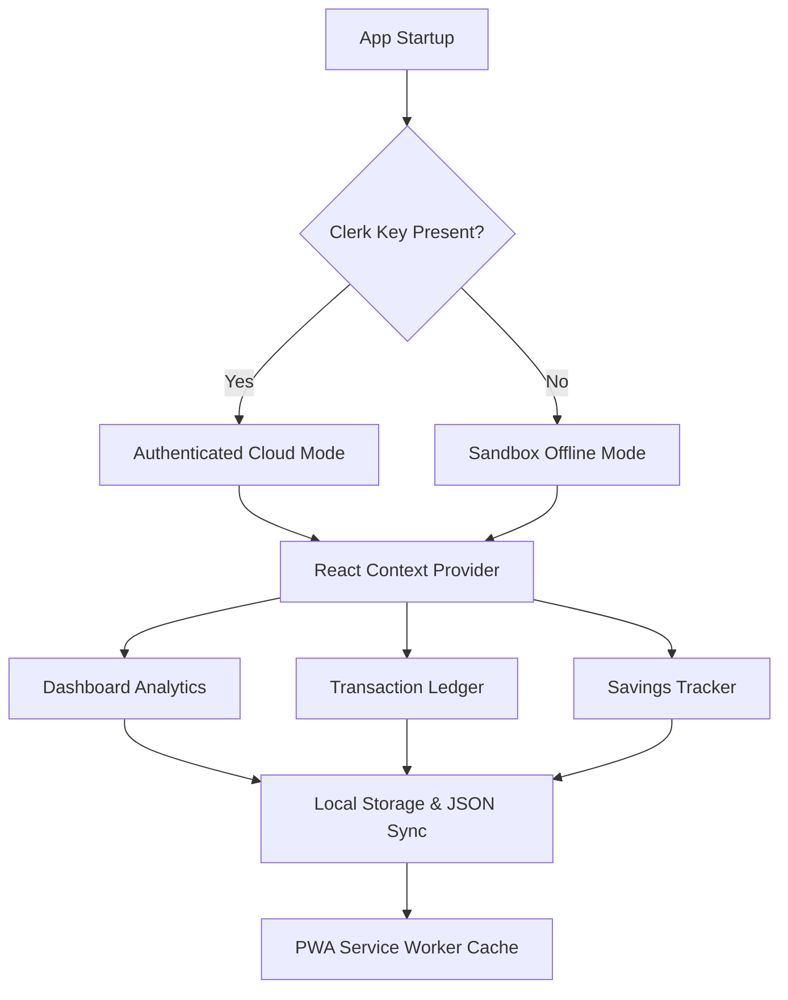

# <p align="center"><br>💳 Budgetify</p>
<p align="center"><strong>Premium Personal Financial Suite</strong></p>

<p align="center">
  <a href="https://react.dev/"></a>
  <a href="https://vite.dev/"></a>
  <a href="https://clerk.com/"></a>
  <a href="https://developer.mozilla.org/en-US/docs/Web/Progressive_web_apps"></a>
  <a href="./LICENSE"></a>
</p>

<p align="center">
  <a href="https://budget-planner-v2-0.vercel.app/"><strong>Explore the Live Application »</strong></a>
</p>

---

## 🌟 Overview

**Budgetify** is a premium, state-of-the-art personal finance planner and cashflow tracking suite. Engineered with an immersive glassmorphic user interface, interactive visual analytics, and offline-capable Progressive Web App (PWA) utilities, Budgetify empowers users to take absolute, uncompromised control of their financial dashboards across desktop and mobile viewports alike.

> [!NOTE]
> Budgetify is designed as a secure, local-first financial companion. It includes an intelligent sandbox bypass that allows developer inspection and instant evaluation even without cloud configurations active.

---

## 🎨 Immersive User Interface & Live Mockup

<p align="center">
  <kbd>
    
  </kbd>
  <br>
  <em>Figure 1: Immersive glassmorphic dashboard showcasing real-time data streaming and interactive financial components.</em>
</p>

---

## ✨ Outstanding Capabilities

### 📊 Cashflow Dashboard & Visual Analytics
* **Dynamic Segments Donut Chart**: An interactive, SVG-rendered vector analytics wheel representing monthly expense distributions. Hovering or tapping individual categories displays real-time breakdowns in the center ring with smooth CSS transitions.
* **Dual Income & Expense Ledger**: Computes net income flow versus outgoing expenses, supplemented by real-time budget depletion meters and net monthly balance monitors.
* **Intelligent Finance Copilot**: Evaluates transaction activities to celebrate high savings rates or instantly flag over-budget breaches with helpful, context-aware suggestions.

### 🔒 Dual-State Security Infrastructure
* **Clerk Enterprise Integration**: Pre-configured for enterprise-grade secure user account profiles and seamless cloud authentication flows (`@clerk/clerk-react`).
* **Zero-Config Developer Sandbox**: If Clerk credentials are not detected in the local environment, Budgetify gracefully transitions to an elegant **Developer Sandbox**. This allows immediate evaluation of the entire suite with rich mockup data—zero setups required.

### 📱 Premium Mobile Ergonomics
* **Adaptive Device Geometry**: Breakpoints are meticulously tailored so that compact viewports offer a native-app feel.
* **Sticky Bottom Navigation**: Elegant navigation bar featuring fluid micro-interactions for seamless transitions across *Dashboard*, *Transactions*, *Savings*, *Categories*, and *Settings*.
* **Action Sheet Modals**: Fully hardware-accelerated action sheets rise smoothly from the bottom of the viewport for comfortable, thumb-friendly interactions.

### 🔋 Progressive Web App (PWA) Support
* **Desktop & Mobile Shell Installation**: Fully compliant manifest metadata enabling desktop dock shortcuts and home-screen app integrations.
* **Intelligent Caching Service Worker**: Employs a lightweight caching layer that caches critical shell scripts, rendering styles, and static assets for instant load times and offline usability.
* **Contextual Install Triggers**: Displays glassmorphic installation prompts inside the sidebar and settings panels when eligible, with tailored manual instructions for Safari iOS.

### 🛠️ Administrative Control Center
* **Encrypted JSON Backups**: Seamlessly export all transaction ledgers and settings to a local JSON file, and restore them instantly across different devices.
* **Multi-Currency Engine**: Dynamically format values across five global currencies: `Rwf`, `$`, `€`, `£`, and `¥`.
* **Theme Customization Accent Palette**: Tailor accent colors and transition between dark and light modes with seamless background blends.

---

## 🧩 Architectural Design System

Budgetify's architecture separates cloud coordination, local storage synchronization, and premium styling layers:



### Tech Stack Matrix

| Layer | Technology | Primary Purpose |
| :--- | :--- | :--- |
| **Framework** | **React 19** + **Vite 8** | Ultra-fast client-side hot module replacement and components. |
| **Styling** | **Vanilla CSS3** | Custom variables, hardware-accelerated transitions, and glassmorphism. |
| **Authentication** | **Clerk React SDK** | Secure user sessions, social login, and cloud profile management. |
| **Data Sync** | **Local Storage & JSON** | Instant local data replication and robust export/import routines. |
| **Offline Power** | **Lightweight Service Worker** | Instantly loading application shell and static assets completely offline. |

---

## 🚀 Local Deployment Guide

### 📋 Prerequisites
Ensure you have the following installed on your machine:
* [Node.js](https://nodejs.org/) (v18.0.0 or higher)
* [npm](https://www.npmjs.com/) (v9.0.0 or higher)

### 1. Repository Installation
Clone the repository and install the project dependencies:
```bash
npm install
```

### 2. Environment Variables Configuration
To set up secure user login profiles using Clerk, create a `.env` file in the root directory:
```env
# Clerk Publishable API Key from dashboard.clerk.com
VITE_CLERK_PUBLISHABLE_KEY=pk_test_your_clerk_key
```

> [!TIP]
> **No Clerk Key? No Problem.** Omit the `.env` file or leave it blank, and the app will automatically launch in **Developer Sandbox Mode** so you can start testing immediately.

### 3. Launch Development Server
Start the local server using Vite:
```bash
npm run dev
```
Open **[http://localhost:5173/](http://localhost:5173/)** in your browser.

---

## ⚡ Production Deployment (Vercel)

Follow these steps to deploy your own instance of Budgetify on Vercel:

1. Connect your repository to [Vercel](https://vercel.com/).
2. In the **Project Settings** > **Environment Variables** panel, add:
   * **Key**: `VITE_CLERK_PUBLISHABLE_KEY`
   * **Value**: *[Paste your Clerk publishable key]*
3. Trigger a **Redeploy** on the dashboard so Vite compiles the environment key into your production JavaScript bundle.
4. Ensure your Vercel URL (e.g. `https://budgetify.vercel.app`) is registered in your Clerk dashboard under **Authorized Domains**.

---

## 🔒 Security Modes Comparison

| Feature / Metric | Clerk Authenticated Mode | Developer Sandbox Mode |
| :--- | :---: | :---: |
| **Target Audience** | Production Users | Local Developers / Evaluators |
| **Authentication Requirement** | Secure Login (Email, Google, etc.) | None (Bypass Active) |
| **Data Storage Location** | Session-bound / Local Sandbox | Persistent LocalStorage |
| **Cloud Profile Sync** | Yes (Via Clerk) | No (Local-first only) |
| **Data Portability** | JSON Export & Import | JSON Export & Import |

---

## 📄 License & Attribution

### Created by **[@nshh123](https://github.com/nshh123)**. 

### License
This project is officially licensed under the **GNU General Public License v3.0 (GPLv3)** — a strong copyleft license designed to guarantee your freedom to share and change all versions of the software.

> [!IMPORTANT]
> **GPLv3 Copyleft Compliance**
> Under the GPLv3 license, anyone is free to clone, study, and modify Budgetify. However, **any derivative works, modifications, or redistribution of this software MUST also be released open-source under the same GPLv3 license**. This guarantees that the project remains free and open-source forever.

For the full legal terms and conditions, please consult the [LICENSE](file:///d:/projects/budget-planner_v2.0/LICENSE) file included in this repository.
